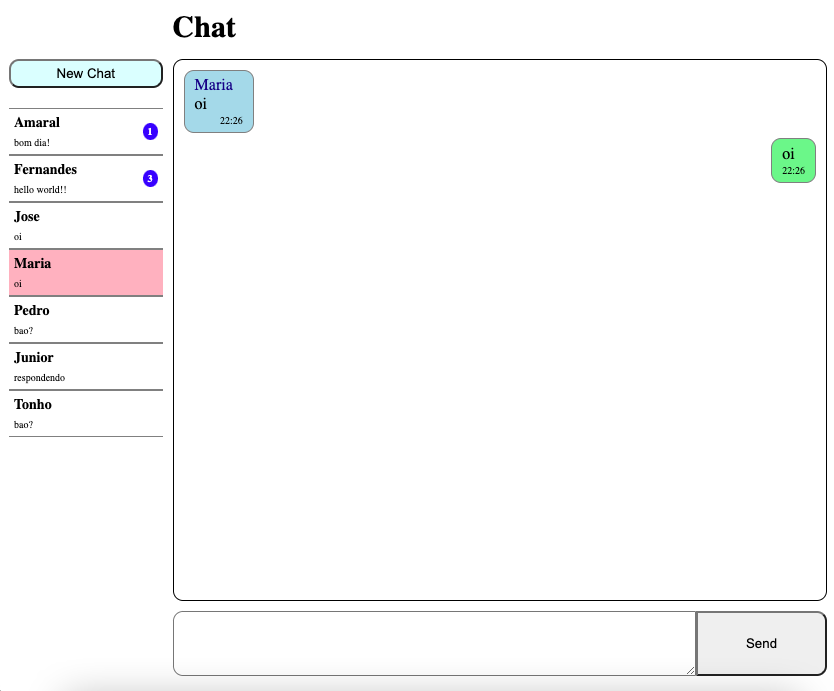

<h1 align="center">🗣 Live Chat 🌎</h1>

  

<h2>
This project is a simple chat box where people can talk to each other online.
</h2>

## 💻 Project

On the first acces to the chat page, the user will be asked to type in a name to start chating. After that, the chat box will show up and it will be possible to send messages to other users.  
Each tab open in the browser will be a different user and the position and layout of the messages will be different according to who is the sender and who is the receiver of the message.

## 🚀 Technologies

This project was developed using the following technologies:

- HTML e CSS
- JavaScript
- nodeJS
- Websocket
- Git e Github

## 🔖 How to access it

- Download the zip file, download the modules needed with <code>npm install</code>, run <code>npm run server</code> on the terminal and access localhost on a browser.
